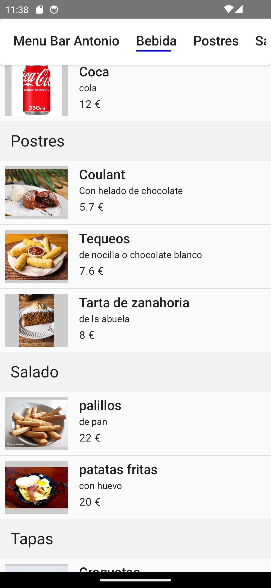
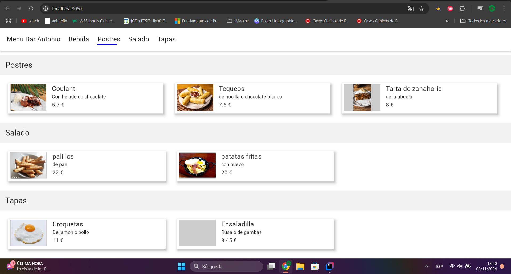

# App Multiplataforma de Cartas Digitales para Bares

Esta aplicación es el cliente multiplataforma para la **API de Cartas Digitales para Bares** (https://github.com/Teleco99/Backend---BarsMenuApi), diseñada para dispositivos Android y con soporte para una aplicación web. Proporciona una interfaz intuitiva para que los usuarios exploren y gestionen cartas digitales de productos de forma interactiva.

### Editar Carta

### Carta en Pantallas Pequeñas(sea Web o Android)

### Subir Imagen de Producto (actualmente solo en Android)

### Carta Pantallas Grandes (sea Web o Android)

## Características

- **Multiplataforma**: Desarrollada para Android y web, ofreciendo una experiencia de usuario coherente en ambas plataformas.
- **Arquitectura Hexagonal (Application - Domain - Infrastructure)**: Con una arquitectura MVVM organizada en capas hexagonales que separan la lógica de negocio (domain), la lógica de aplicación (application) y la infraestructura (infraestructure).
- **Vistas Adaptativas y Declarativas**: Utiliza Jetpack Compose para construir vistas declarativas y adaptativas, garantizando una experiencia visual fluida en dispositivos de diferentes tamaños.
- **Inyección de Dependencias**: Koin facilita la inyección de dependencias de forma limpia y modular.
- **Comunicación de Red con Ktor**: Maneja las solicitudes de red hacia la API de manera eficiente y segura con Ktor.
- **Carga y Cacheo de Imágenes con Coil**: Optimiza el rendimiento con carga y cacheo de imágenes.
- **MVVM Encapsulado**: La arquitectura MVVM está encapsulada dentro del patrón hexagonal, organizando las capas de manera efectiva para mejorar la mantenibilidad del código.

## Librerías Utilizadas

- **Ktor**: Comunicación con la API y manejo de redes.
- **Koin**: Inyección de dependencias.
- **Coil**: Carga y cacheo de imágenes.
- **Jetpack Compose**: Construcción de UI declarativa y responsiva.

## Notas de versión

- **Refactorización de casos de uso para nuevas relaciones del backend (https://github.com/Teleco99/Backend---BarsMenuApi)**: Adaptados para integrarse con los cambios estructurales en las entidades del backend.

- **Soporte para picker de imágenes en aplicación web (WASM)**: Permite seleccionar imágenes directamente desde la interfaz web.

- **Caché para evitar peticiones recurrentes**: Mejora el rendimiento al almacenar resultados previamente obtenidos.

- **Comprobación de existencia de imágenes de productos con nuevo campo en BD (https://github.com/Teleco99/Backend---BarsMenuApi)**: Se optimizan recursos al evitar solicitudes innecesarias al servidor.