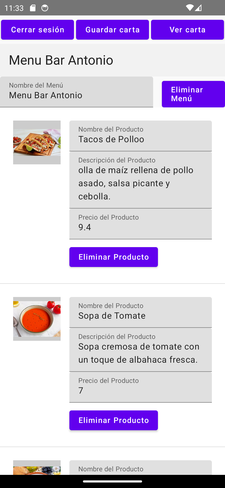

# App Multiplataforma de Cartas Digitales para Bares

Esta aplicación es el cliente multiplataforma para la **API de Cartas Digitales para Bares** (https://github.com/Teleco99/Backend---BarsMenuApi), diseñada para dispositivos Android y con soporte para una aplicación web. Proporciona una interfaz intuitiva para que los usuarios exploren y gestionen cartas digitales de productos de forma interactiva.

### Editar Carta

### Carta en Pantallas Pequeñas(sea Web o Android)

### Subir Imagen de Producto (actualmente solo en Android)

### Carta Pantallas Grandes (sea Web o Android)

## Características

- **Multiplataforma**: Desarrollada para Android y web, ofreciendo una experiencia de usuario coherente en ambas plataformas.
- **Arquitectura Hexagonal (Application - Domain - Infrastructure)**: Con una arquitectura MVVM organizada en capas hexagonales que separan la lógica de negocio (domain), la lógica de aplicación (application) y la infraestructura (infraestructure).
- **Vistas Adaptativas y Declarativas**: Utiliza Jetpack Compose para construir vistas declarativas y adaptativas, garantizando una experiencia visual fluida en dispositivos de diferentes tamaños.
- **Inyección de Dependencias**: Koin facilita la inyección de dependencias de forma limpia y modular.
- **Comunicación de Red con Ktor**: Maneja las solicitudes de red hacia la API de manera eficiente y segura con Ktor.
- **Carga y Cacheo de Imágenes con Coil**: Optimiza el rendimiento con carga y cacheo de imágenes.
- **MVVM Encapsulado**: La arquitectura MVVM está encapsulada dentro del patrón hexagonal, organizando las capas de manera efectiva para mejorar la mantenibilidad del código.

## Librerías Utilizadas

- **Ktor**: Comunicación con la API y manejo de redes.
- **Koin**: Inyección de dependencias.
- **Coil**: Carga y cacheo de imágenes.
- **Jetpack Compose**: Construcción de UI declarativa y responsiva.

## Próximas Mejoras

- **Carga de Imágenes desde Aplicación Web**: Se usará la API de DOM para cargarlas en la aplicación y mandarlas al servidor.
- **Implementación de Caché en el Repositorio**: Se evitarán peticiones recurrentes a la API, reduciendo la carga en el servidor mediante almacenamiento en caché de datos. Esto mejorará la eficiencia y la velocidad de la aplicación.
- **Optimización de Peticiones de Imágenes**: Añadir un campo en la base de datos para indicar si un producto tiene imagen. De esta forma, solo se realizarán peticiones al servidor para descargar imágenes cuando sea necesario, ahorrando recursos y tiempo de carga.
- **Mejoras Visuales en la Interfaz**: Se optimizará la apariencia y el diseño de la interfaz de usuario para ofrecer una experiencia más atractiva e intuitiva.
- **Sistema de Pedido Online**: Implementación de un sistema para que los comensales puedan realizar pedidos directamente desde la carta digital.
- **Implementación de Códigos de Test**: Añadir cobertura de pruebas a las distintas capas de la aplicación para facilitar la escalabilidad y la detección temprana de errores, mejorando así la calidad y el mantenimiento del código.
- **Corrección de Bugs**.
